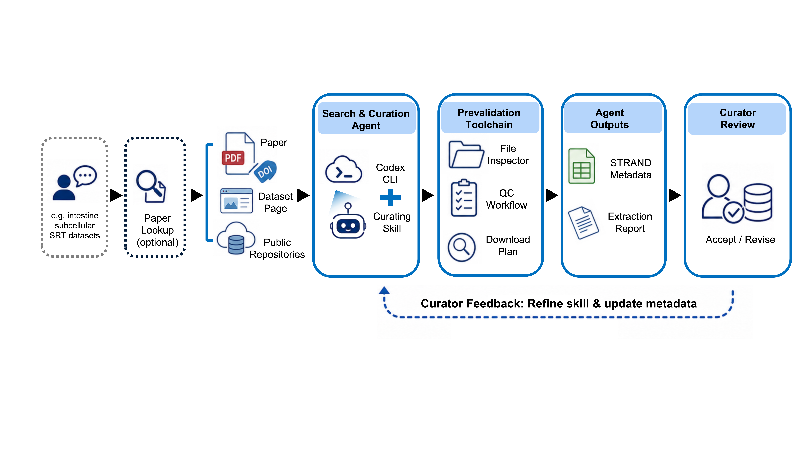

# STRAND Paper-to-Spatial Skill

Codex Skill package for agent-based collection and curation of subcellular-resolution spatial transcriptomics dataset metadata.



The main skill turns a paper PDF, DOI, article URL, dataset landing page, or optional topic-search request into STRAND-style metadata outputs:

- `final_metadata.xlsx`
- `final_metadata.tsv`
- `extraction_report.md`

The skill keeps audit artifacts in `internal/`, including source evidence, download plans, unresolved fields, QC parameters, and validator output. It is designed for curation workflows where an LLM orchestrates prevalidated tools, rather than guessing metadata from paper summaries.

## Repository Layout

```text
skills/
  paper-to-spatial-dataset-extraction/  # main STRAND metadata extraction skill
  paper-lookup/                         # optional bundled upstream search skill
```

`paper-lookup` is bundled as an optional dependency. If available, the main skill can use it for upstream paper discovery. If unavailable or rate-limited, extraction can continue from user-provided PDFs, DOIs, dataset pages, paper-search MCP, BioMCP, or web search.

## Install

The normal installation method is to copy the skill folders into a Codex skills directory.

```bash
git clone https://github.com/Rooneyxu/strand-paper-to-spatial-skill.git
cd strand-paper-to-spatial-skill

mkdir -p ~/.codex/skills
cp -R skills/paper-to-spatial-dataset-extraction ~/.codex/skills/

# Optional: upstream paper search helper
cp -R skills/paper-lookup ~/.codex/skills/
```

Restart Codex or open a new session after copying so the skill list is refreshed.

If you use a shared skill directory instead of the default Codex home, copy the same folders to that directory, for example `~/.agents/skills/`.

The GitHub installer is optional. It is useful for scripted setup, but not required:

```bash
python3 ~/.codex/skills/.system/skill-installer/scripts/install-skill-from-github.py \
  --repo Rooneyxu/strand-paper-to-spatial-skill \
  --path skills/paper-to-spatial-dataset-extraction \
  --dest ~/.codex/skills
```

## Usage

Typical user inputs:

- A topic search request, such as `find intestine subcellular-resolution SRT datasets`
- A local paper PDF path
- A DOI or article URL
- A dataset landing page
- An approved local data file for inspection

Expected public outputs:

```text
final_metadata.xlsx
final_metadata.tsv
extraction_report.md
internal/
```

The report should explain the dataset summary, evidence sources, downloaded files, field-level evidence, QC or counting differences, unresolved fields, and a curator-review conclusion.

## Validation

From the repository root:

```bash
python3 ~/.codex/skills/.system/skill-creator/scripts/quick_validate.py \
  skills/paper-to-spatial-dataset-extraction

python3 ~/.codex/skills/.system/skill-creator/scripts/quick_validate.py \
  skills/paper-lookup

python3 skills/paper-to-spatial-dataset-extraction/scripts/validate_outputs.py \
  --mode public \
  --require-upstream-search \
  skills/paper-to-spatial-dataset-extraction/examples/merfish-intestine-search-demo
```

## Method Summary

This skill follows a curator-in-the-loop workflow. The LLM plans the route, selects sources, records evidence, prepares download plans, runs file inspectors, applies QC workflow records, and writes a metadata report. Numeric metadata must be backed by source or file evidence. Fields that cannot be verified are kept unresolved with a reason and next action.

The core value is LLM orchestration of prevalidated curation tools, not generic paper summarization, review writing, automatic bulk downloading, or copying values from an existing truth table.

## Data and Privacy Boundary

This repository should not contain raw scientific datasets or local machine paths. Do not commit:

- `.h5ad`, `.zarr`, `.tar.gz`, `.zip`, `.pkl`, `.h5`, `.loom`
- PDFs or downloaded raw data
- personal paths, credentials, cookies, or API keys

Small demo metadata outputs are allowed when they are lightweight and contain no third-party raw data.

## License

This repository is released under the MIT License. See `LICENSE`.

Third-party notices for bundled optional dependencies are recorded in `THIRD_PARTY_NOTICES.md`.
